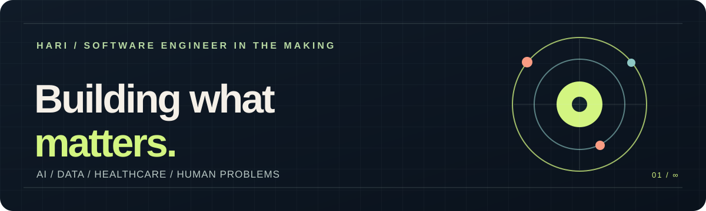

<div align="center">
  
</div>

<br />

### Hey, I'm Hari 👋

I'm a Computer Science student at the University of South Florida. I like taking messy, real-world problems and turning them into software people actually want to use. Lately, that means **small language models**, **reliable data pipelines**, and **better clinic workflows**.

```text
CURRENTLY EXPLORING    →  Efficient AI for practical tasks
BUILDING               →  Fine-tuning SLMs to label support tickets, then comparing their accuracy, speed, and cost with larger models.
WHEN I'M NOT CODING    →  Weightlifting, playing video games, and playing sports
```

### Selected work

| Project | The idea | What I worked on |
| :--- | :--- | :--- |
| **Domain-specific theme labeling** | Teach smaller models to label support themes without relying on a large model for every request. | PEFT experiments, evaluation, and latency/cost comparisons with Break Through Tech AI and Automation Anywhere. |
| **Project Silver** | Make synthetic data and benchmark workflows easier to run and trust. | Docker-based pipelines, testing, and data quality work at AfterQuery. |

### How I work

I build Python-first AI and data tools, then use testing and validation to make them reliable. I've also built real-time voice apps and production software workflows.

**Languages & data:** `Python` · `C` · `Pandas` · `NumPy` · `scikit-learn`  
**Systems & tools:** `Docker` · `Git/GitHub` · `automated testing` · `WebSockets`  
**Voice AI:** `Twilio` · `Deepgram`

<details>
<summary><b>A little more about me</b></summary>
<br />

I enjoy presenting technical work clearly, whether that's a model evaluation, a research poster, or a debate round. I'm especially interested in tools that bring ambitious ideas into everyday use.

</details>

<!-- BEFORE PUBLISHING:
1. Link each project name to its public repository or demo once available.
2. Update any role or project wording that has changed.
3. Add a real LinkedIn, portfolio, or contact link below if you want people to reach you.
4. Pin your best public repositories from your GitHub profile.
-->

<sub>Based in Tampa, Florida · Open to thoughtful collaborations</sub>
